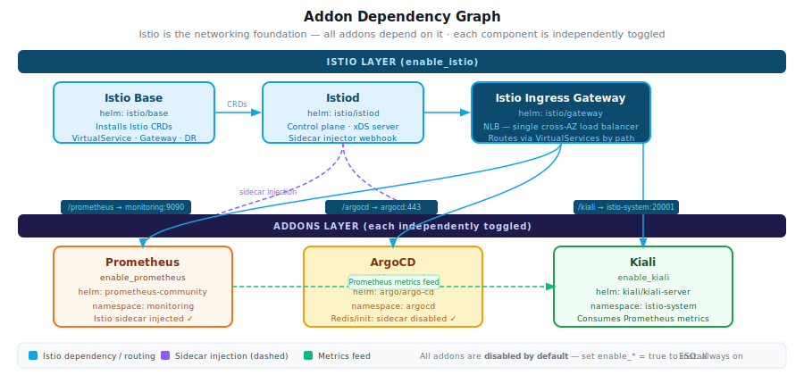
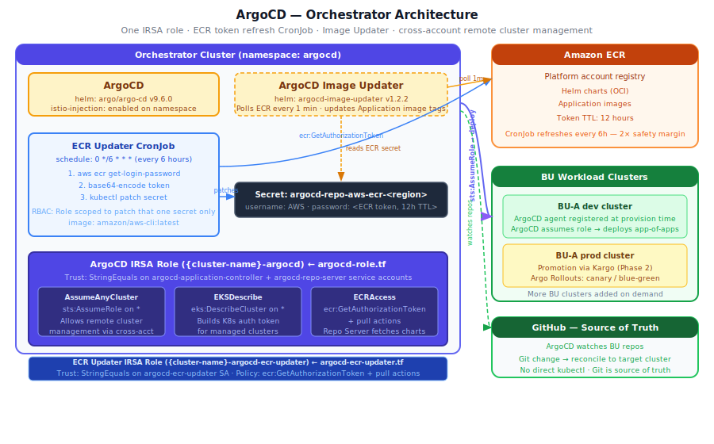
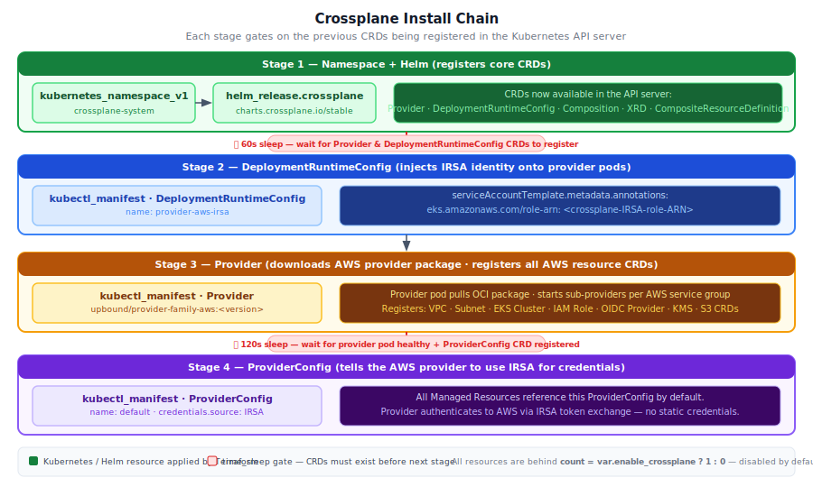
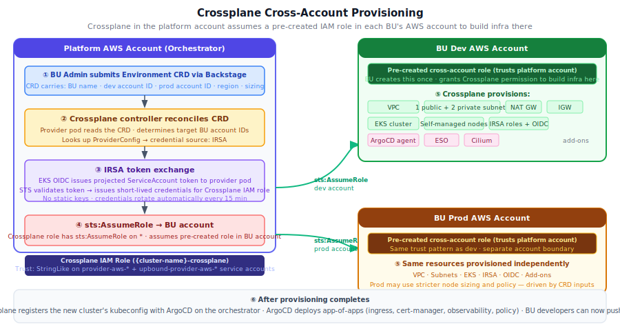

# orchestrator-custom-addons

Terraform module for installing custom addons on EKS clusters in the **urukube** platform. Provides opinionated, toggle-driven installation of the service mesh, observability, GitOps, and secrets management layers.

## Module Architecture

All addons are independently controlled via `enable_*` / `enable_argocd` variables. Istio is the networking foundation — when enabled, all other addons get sidecar injection and are exposed via the Istio Ingress Gateway using VirtualServices.

### Components

| Component | Toggle | Default | Helm Chart Version |
|---|---|---|---|
| Istio (base + istiod + gateway) | `enable_istio` | `false` | `1.30.1` |
| Kiali | `enable_kiali` | `false` | `2.26.0` |
| Prometheus | `enable_prometheus` | `false` | `29.13.0` |
| ArgoCD | `enable_argocd` | `false` | `9.6.0` |
| ArgoCD Image Updater | `enable_argocd` | `false` | `1.2.2` |
| External Secrets Operator | always on | — | `2.6.0` |

### Dependency Graph



---

## ArgoCD



When `enable_argocd = true`, four resources are created across three files:

### `argocd.tf` — Helm release

Installs ArgoCD via the `argo/argo-cd` Helm chart into the `argocd` namespace. The namespace is labeled `istio-injection: enabled` so all ArgoCD pods get an Istio sidecar — **except** Redis and init containers, which have `sidecar.istio.io/inject: "false"` set in `argocd-values.yaml` because Istio intercepts their traffic before readiness is established.

The Helm values template wires in the ArgoCD IRSA role ARN so the `argocd-application-controller` and `argocd-repo-server` service accounts are annotated for IRSA at install time.

### `argocd-role.tf` — Single IRSA role (not hub/spoke)

One IAM role (`{cluster-name}-argocd`) is created for ArgoCD on the orchestrator. It is trusted by exactly two service accounts via `StringEquals`:
- `argocd-application-controller` — reconciles cluster state
- `argocd-repo-server` — fetches Helm charts and manifests from ECR

Three inline policies are attached:

| Policy | Permission | Why |
|---|---|---|
| `argocd-assume-any-cluster` | `sts:AssumeRole` on `*` | ArgoCD assumes a pre-created role on each remote BU cluster (registered at provision time) to deploy into it |
| `argocd-eks-describe` | `eks:DescribeCluster` on `*` | Required to construct the Kubernetes bearer token for the remote cluster API server |
| `argocd-ecr-access` | ECR pull actions | Repo Server fetches OCI Helm charts and images from the platform ECR registry |

> **No spoke role is created here.** The role that ArgoCD assumes on each BU cluster is created at cluster-provisioning time by Crossplane — not by this module.

### `argocd-ecr-updater.tf` — ECR token refresh CronJob

ECR tokens expire after **12 hours**. ArgoCD needs a valid token in a Kubernetes Secret to pull from ECR. Rather than using a long-lived credential, a lightweight CronJob refreshes the token every **6 hours** (2× safety margin before expiry).

The CronJob flow:
1. Pod runs on schedule `0 */6 * * *` using `amazon/aws-cli:latest`
2. Calls `aws ecr get-login-password` — authenticated via its own dedicated IRSA role (`{cluster-name}-argocd-ecr-updater`)
3. Base64-encodes the token and patches the Secret `argocd-repo-aws-ecr-<region>` in the `argocd` namespace
4. RBAC is scoped tightly: a `Role` grants only `get` and `patch` on that one named secret — no broader cluster access

### `argocd-image-updater.tf` — Automatic image tag tracking

ArgoCD Image Updater polls the ECR registry every **1 minute** and automatically updates ArgoCD `Application` image tags when a new image is pushed. It reuses the ECR secret maintained by the CronJob above — configured via `credentials: secret:argocd-repo-aws-ecr-<region>`.

---

## Crossplane — Infrastructure Provisioning Engine

Crossplane is the most complex addon in this module. It is the engine that turns a BU's environment request into real AWS infrastructure, provisioned inside the BU's own AWS accounts without any manual work.

### What it does

When `enable_crossplane = true`, Crossplane is installed on the orchestrator cluster and configured to watch for **Environment CRDs**. When a BU Admin submits a request via Backstage, Backstage creates that CRD. Crossplane reconciles it by assuming a cross-account IAM role in the BU's AWS account and building the full environment — VPC, subnets, EKS cluster, IRSA roles, OIDC provider, and bootstrap add-ons — from scratch, autonomously.

### Install chain

Crossplane cannot be installed in a single Terraform `apply` pass because each stage registers new CRDs that the next stage depends on. The install is broken into four sequential stages gated by `time_sleep` resources.



| Stage | Resource | Gate | Why |
|---|---|---|---|
| **1** | `helm_release.crossplane` | 60s sleep | Helm returns before CRDs are registered. `Provider` and `DeploymentRuntimeConfig` kinds must exist in the API before Stage 2 can apply. |
| **2** | `kubectl_manifest.crossplane_runtime_config` | none | Creates a `DeploymentRuntimeConfig` that injects the IRSA role ARN as a pod annotation onto every provider service account. Without this, provider pods have no AWS identity. |
| **3** | `kubectl_manifest.crossplane_provider_aws` | 120s sleep | Crossplane pulls the `upbound/provider-family-aws` OCI package, starts sub-provider pods (one per AWS service group), and registers all AWS resource CRDs (`VPC`, `Subnet`, `EKS Cluster`, `IAM Role`, etc.). The 120s wait covers the OCI pull and pod startup time. |
| **4** | `kubectl_manifest.crossplane_provider_config` | none | Creates the `ProviderConfig` (name: `default`) telling the AWS provider to source credentials from IRSA. All future Managed Resources reference this config. |

#### Why two `time_sleep` values?

- **60s after Helm**: CRD registration is near-instant once the Crossplane pod starts, but pod startup itself takes 20–40s. 60s is conservative headroom.
- **120s after the Provider**: The provider must pull an OCI image (~200 MB), start multiple sub-provider pods, and register hundreds of CRDs. On a cold cluster with a fresh image pull, 120s is the practical minimum.

### Cross-account provisioning

Crossplane on the orchestrator (platform account) provisions infrastructure inside BU AWS accounts using a chain of IAM assumptions — no static credentials anywhere.



#### Authentication chain

1. The EKS OIDC provider issues a **projected ServiceAccount token** to the Crossplane provider pod at runtime.
2. The pod presents that token to STS via `sts:AssumeRoleWithWebIdentity` — IRSA — and receives short-lived credentials for the **Crossplane IAM role** in the platform account. Credentials rotate automatically every 15 minutes.
3. The Crossplane IAM role has `sts:AssumeRole` on `*`. When reconciling a BU environment CRD, Crossplane calls `sts:AssumeRole` against a **pre-created cross-account role in the BU's AWS account** and receives credentials scoped to that account.
4. Using those credentials, Crossplane creates all resources (VPC, subnets, EKS, IAM roles, OIDC provider) inside the BU account.

#### IRSA trust policy — why `StringLike`?

```json
"StringLike": {
  "<oidc-provider>:sub": [
    "system:serviceaccount:crossplane-system:provider-aws-*",
    "system:serviceaccount:crossplane-system:upbound-provider-aws-*"
  ]
}
```

The Upbound family provider spawns **one sub-provider pod per AWS service group** (e.g. `upbound-provider-aws-ec2`, `upbound-provider-aws-eks`, `upbound-provider-aws-iam`), each with its own Kubernetes service account. `StringEquals` would require enumerating every sub-provider name and updating the trust policy whenever a new sub-provider is added. `StringLike` with a wildcard covers all current and future sub-providers with no IAM changes.

#### What the Crossplane IAM role can do

| Permission group | Actions | Purpose |
|---|---|---|
| `EC2` | `ec2:*` | VPC, subnets, route tables, NAT GW, security groups, launch templates |
| `EKS` | `eks:*` | EKS control plane, node groups, access entries |
| `IAM` | Scoped list | IRSA roles, OIDC providers, instance profiles — scoped to exact actions, not `iam:*` |
| `KMS` | Scoped list | EBS encryption keys for BU cluster nodes |
| `S3` | Scoped list | Terraform state buckets and BU S3 resources |
| `STS` | `sts:AssumeRole` on `*` | Cross-account entry into each BU AWS account |

#### What the BU must prepare (once)

Before Crossplane can provision into a BU account, the BU (or platform team on their behalf) must create a **cross-account IAM role** in that account with:
- A trust policy allowing `sts:AssumeRole` from the platform account's Crossplane role ARN
- Permissions sufficient to build the resources listed above

This role is created once per BU account (dev and prod separately) and never changes.

<!-- BEGIN_TF_DOCS -->
## Requirements

| Name | Version |
|------|---------|
| <a name="requirement_terraform"></a> [terraform](#requirement\_terraform) | >= 1.5.0 |
| <a name="requirement_aws"></a> [aws](#requirement\_aws) | >= 6.42.0 |
| <a name="requirement_helm"></a> [helm](#requirement\_helm) | ~> 3.0 |
| <a name="requirement_kubectl"></a> [kubectl](#requirement\_kubectl) | >= 1.14.0 |
| <a name="requirement_kubernetes"></a> [kubernetes](#requirement\_kubernetes) | >= 2.35.0 |
| <a name="requirement_random"></a> [random](#requirement\_random) | ~> 3.6 |
| <a name="requirement_time"></a> [time](#requirement\_time) | >= 0.9.0 |

## Providers

| Name | Version |
|------|---------|
| <a name="provider_aws"></a> [aws](#provider\_aws) | >= 6.42.0 |
| <a name="provider_helm"></a> [helm](#provider\_helm) | ~> 3.0 |
| <a name="provider_kubectl"></a> [kubectl](#provider\_kubectl) | >= 1.14.0 |
| <a name="provider_kubernetes"></a> [kubernetes](#provider\_kubernetes) | >= 2.35.0 |
| <a name="provider_random"></a> [random](#provider\_random) | ~> 3.6 |
| <a name="provider_time"></a> [time](#provider\_time) | >= 0.9.0 |

## Modules

No modules.

## Resources

| Name | Type |
|------|------|
| [aws_iam_policy.ecr_cross_account](https://registry.terraform.io/providers/hashicorp/aws/latest/docs/resources/iam_policy) | resource |
| [aws_iam_role.argocd_ecr_updater](https://registry.terraform.io/providers/hashicorp/aws/latest/docs/resources/iam_role) | resource |
| [aws_iam_role.argocd_orchestrator](https://registry.terraform.io/providers/hashicorp/aws/latest/docs/resources/iam_role) | resource |
| [aws_iam_role.crossplane](https://registry.terraform.io/providers/hashicorp/aws/latest/docs/resources/iam_role) | resource |
| [aws_iam_role.ecr_cross_account](https://registry.terraform.io/providers/hashicorp/aws/latest/docs/resources/iam_role) | resource |
| [aws_iam_role.eso](https://registry.terraform.io/providers/hashicorp/aws/latest/docs/resources/iam_role) | resource |
| [aws_iam_role_policy.argocd_assume_any_cluster](https://registry.terraform.io/providers/hashicorp/aws/latest/docs/resources/iam_role_policy) | resource |
| [aws_iam_role_policy.argocd_ecr_access](https://registry.terraform.io/providers/hashicorp/aws/latest/docs/resources/iam_role_policy) | resource |
| [aws_iam_role_policy.argocd_ecr_updater_policy](https://registry.terraform.io/providers/hashicorp/aws/latest/docs/resources/iam_role_policy) | resource |
| [aws_iam_role_policy.argocd_eks_describe](https://registry.terraform.io/providers/hashicorp/aws/latest/docs/resources/iam_role_policy) | resource |
| [aws_iam_role_policy.crossplane_infra](https://registry.terraform.io/providers/hashicorp/aws/latest/docs/resources/iam_role_policy) | resource |
| [aws_iam_role_policy.eso_secrets_access](https://registry.terraform.io/providers/hashicorp/aws/latest/docs/resources/iam_role_policy) | resource |
| [aws_iam_role_policy_attachment.ecr_cross_account](https://registry.terraform.io/providers/hashicorp/aws/latest/docs/resources/iam_role_policy_attachment) | resource |
| [helm_release.argocd](https://registry.terraform.io/providers/hashicorp/helm/latest/docs/resources/release) | resource |
| [helm_release.argocd_image_updater](https://registry.terraform.io/providers/hashicorp/helm/latest/docs/resources/release) | resource |
| [helm_release.crossplane](https://registry.terraform.io/providers/hashicorp/helm/latest/docs/resources/release) | resource |
| [helm_release.external_secrets](https://registry.terraform.io/providers/hashicorp/helm/latest/docs/resources/release) | resource |
| [helm_release.istio_base](https://registry.terraform.io/providers/hashicorp/helm/latest/docs/resources/release) | resource |
| [helm_release.istio_ingress](https://registry.terraform.io/providers/hashicorp/helm/latest/docs/resources/release) | resource |
| [helm_release.istiod](https://registry.terraform.io/providers/hashicorp/helm/latest/docs/resources/release) | resource |
| [helm_release.kiali](https://registry.terraform.io/providers/hashicorp/helm/latest/docs/resources/release) | resource |
| [helm_release.prometheus](https://registry.terraform.io/providers/hashicorp/helm/latest/docs/resources/release) | resource |
| [kubectl_manifest.argocd_vs](https://registry.terraform.io/providers/gavinbunney/kubectl/latest/docs/resources/manifest) | resource |
| [kubectl_manifest.crossplane_provider_aws](https://registry.terraform.io/providers/gavinbunney/kubectl/latest/docs/resources/manifest) | resource |
| [kubectl_manifest.crossplane_provider_config](https://registry.terraform.io/providers/gavinbunney/kubectl/latest/docs/resources/manifest) | resource |
| [kubectl_manifest.crossplane_runtime_config](https://registry.terraform.io/providers/gavinbunney/kubectl/latest/docs/resources/manifest) | resource |
| [kubectl_manifest.istio_gateway](https://registry.terraform.io/providers/gavinbunney/kubectl/latest/docs/resources/manifest) | resource |
| [kubectl_manifest.kiali_vs](https://registry.terraform.io/providers/gavinbunney/kubectl/latest/docs/resources/manifest) | resource |
| [kubectl_manifest.prometheus_vs](https://registry.terraform.io/providers/gavinbunney/kubectl/latest/docs/resources/manifest) | resource |
| [kubernetes_cron_job_v1.argocd_ecr_updater](https://registry.terraform.io/providers/hashicorp/kubernetes/latest/docs/resources/cron_job_v1) | resource |
| [kubernetes_ingress_class_v1.istio](https://registry.terraform.io/providers/hashicorp/kubernetes/latest/docs/resources/ingress_class_v1) | resource |
| [kubernetes_namespace_v1.argocd](https://registry.terraform.io/providers/hashicorp/kubernetes/latest/docs/resources/namespace_v1) | resource |
| [kubernetes_namespace_v1.crossplane](https://registry.terraform.io/providers/hashicorp/kubernetes/latest/docs/resources/namespace_v1) | resource |
| [kubernetes_namespace_v1.eso](https://registry.terraform.io/providers/hashicorp/kubernetes/latest/docs/resources/namespace_v1) | resource |
| [kubernetes_namespace_v1.istio_system](https://registry.terraform.io/providers/hashicorp/kubernetes/latest/docs/resources/namespace_v1) | resource |
| [kubernetes_namespace_v1.monitoring](https://registry.terraform.io/providers/hashicorp/kubernetes/latest/docs/resources/namespace_v1) | resource |
| [kubernetes_role_binding_v1.argocd_secret_patcher](https://registry.terraform.io/providers/hashicorp/kubernetes/latest/docs/resources/role_binding_v1) | resource |
| [kubernetes_role_v1.argocd_secret_patcher](https://registry.terraform.io/providers/hashicorp/kubernetes/latest/docs/resources/role_v1) | resource |
| [kubernetes_secret_v1.argocd_redis](https://registry.terraform.io/providers/hashicorp/kubernetes/latest/docs/resources/secret_v1) | resource |
| [kubernetes_service_account_v1.argocd_ecr_updater](https://registry.terraform.io/providers/hashicorp/kubernetes/latest/docs/resources/service_account_v1) | resource |
| [random_password.argocd_redis](https://registry.terraform.io/providers/hashicorp/random/latest/docs/resources/password) | resource |
| [time_sleep.wait_for_crossplane_crds](https://registry.terraform.io/providers/hashicorp/time/latest/docs/resources/sleep) | resource |
| [time_sleep.wait_for_provider_crds](https://registry.terraform.io/providers/hashicorp/time/latest/docs/resources/sleep) | resource |
| [aws_caller_identity.current](https://registry.terraform.io/providers/hashicorp/aws/latest/docs/data-sources/caller_identity) | data source |
| [aws_partition.current](https://registry.terraform.io/providers/hashicorp/aws/latest/docs/data-sources/partition) | data source |
| [aws_region.current](https://registry.terraform.io/providers/hashicorp/aws/latest/docs/data-sources/region) | data source |

## Inputs

| Name | Description | Type | Default | Required |
|------|-------------|------|---------|:--------:|
| <a name="input_app_id"></a> [app\_id](#input\_app\_id) | application Unit | `string` | `null` | no |
| <a name="input_argocd_version"></a> [argocd\_version](#input\_argocd\_version) | Version of the ArgoCD Helm chart | `string` | `"9.6.0"` | no |
| <a name="input_bu_id"></a> [bu\_id](#input\_bu\_id) | Business Unit | `string` | `null` | no |
| <a name="input_cluster_certificate_authority_data"></a> [cluster\_certificate\_authority\_data](#input\_cluster\_certificate\_authority\_data) | Base64 encoded certificate authority data for the cluster | `string` | n/a | yes |
| <a name="input_cluster_endpoint"></a> [cluster\_endpoint](#input\_cluster\_endpoint) | Endpoint URL of the EKS cluster API server | `string` | n/a | yes |
| <a name="input_cluster_name"></a> [cluster\_name](#input\_cluster\_name) | Name of the EKS cluster | `string` | n/a | yes |
| <a name="input_cluster_oidc_issuer_url"></a> [cluster\_oidc\_issuer\_url](#input\_cluster\_oidc\_issuer\_url) | URL of the OIDC issuer for the EKS cluster | `string` | n/a | yes |
| <a name="input_cluster_oidc_provider_arn"></a> [cluster\_oidc\_provider\_arn](#input\_cluster\_oidc\_provider\_arn) | ARN of the OIDC provider for IRSA (IAM Roles for Service Accounts) | `string` | n/a | yes |
| <a name="input_crossplane_provider_aws_version"></a> [crossplane\_provider\_aws\_version](#input\_crossplane\_provider\_aws\_version) | Version of the upbound/provider-family-aws Crossplane provider | `string` | `"v1.21.0"` | no |
| <a name="input_crossplane_version"></a> [crossplane\_version](#input\_crossplane\_version) | Version of the Crossplane Helm chart | `string` | `"1.19.0"` | no |
| <a name="input_domain_url"></a> [domain\_url](#input\_domain\_url) | Base domain URL for the platform (e.g., orbitcluster.platform.com, xyz.company.com) | `string` | `""` | no |
| <a name="input_enable_argocd"></a> [enable\_argocd](#input\_enable\_argocd) | Enable ArgoCD addon | `bool` | `false` | no |
| <a name="input_enable_crossplane"></a> [enable\_crossplane](#input\_enable\_crossplane) | Enable Crossplane infrastructure provisioning engine | `bool` | `false` | no |
| <a name="input_enable_ecr"></a> [enable\_ecr](#input\_enable\_ecr) | Enable ECR cross-account pull role for BU clusters | `bool` | `false` | no |
| <a name="input_enable_eso"></a> [enable\_eso](#input\_enable\_eso) | Enable External Secrets Operator addon | `bool` | `false` | no |
| <a name="input_enable_istio"></a> [enable\_istio](#input\_enable\_istio) | Enable Istio addon | `bool` | `false` | no |
| <a name="input_enable_kiali"></a> [enable\_kiali](#input\_enable\_kiali) | Enable Kiali addon | `bool` | `false` | no |
| <a name="input_enable_prometheus"></a> [enable\_prometheus](#input\_enable\_prometheus) | Enable Prometheus addon | `bool` | `false` | no |
| <a name="input_env"></a> [env](#input\_env) | Environment name (dev, staging, prod) | `string` | n/a | yes |
| <a name="input_eso_helm_version"></a> [eso\_helm\_version](#input\_eso\_helm\_version) | Version of the External Secrets Operator Helm chart | `string` | `"2.6.0"` | no |
| <a name="input_istio_version"></a> [istio\_version](#input\_istio\_version) | Version of the Istio Helm chart | `string` | `"1.30.1"` | no |
| <a name="input_kiali_version"></a> [kiali\_version](#input\_kiali\_version) | Version of the Kiali Helm chart | `string` | `"2.26.0"` | no |
| <a name="input_prometheus_version"></a> [prometheus\_version](#input\_prometheus\_version) | Version of the Prometheus Helm chart | `string` | `"29.13.0"` | no |
| <a name="input_tags"></a> [tags](#input\_tags) | Tags to apply to all resources | `map(string)` | `{}` | no |

## Outputs

| Name | Description |
|------|-------------|
| <a name="output_argocd_namespace"></a> [argocd\_namespace](#output\_argocd\_namespace) | Namespace where ArgoCD is installed |
| <a name="output_argocd_release_name"></a> [argocd\_release\_name](#output\_argocd\_release\_name) | Name of the ArgoCD Helm release |
| <a name="output_argocd_role_arn"></a> [argocd\_role\_arn](#output\_argocd\_role\_arn) | IAM role ARN for ArgoCD on the orchestrator cluster (IRSA) |
| <a name="output_argocd_role_name"></a> [argocd\_role\_name](#output\_argocd\_role\_name) | IAM role name for ArgoCD on the orchestrator cluster (IRSA) |
| <a name="output_istio_base_release_name"></a> [istio\_base\_release\_name](#output\_istio\_base\_release\_name) | Name of the Istio Base Helm release |
| <a name="output_istio_system_namespace"></a> [istio\_system\_namespace](#output\_istio\_system\_namespace) | Namespace where Istio is installed |
| <a name="output_istiod_release_name"></a> [istiod\_release\_name](#output\_istiod\_release\_name) | Name of the Istiod Helm release |
| <a name="output_kiali_namespace"></a> [kiali\_namespace](#output\_kiali\_namespace) | Namespace where Kiali is installed |
| <a name="output_kiali_release_name"></a> [kiali\_release\_name](#output\_kiali\_release\_name) | Name of the Kiali Helm release |
| <a name="output_prometheus_namespace"></a> [prometheus\_namespace](#output\_prometheus\_namespace) | Namespace where Prometheus is installed |
| <a name="output_prometheus_release_name"></a> [prometheus\_release\_name](#output\_prometheus\_release\_name) | Name of the Prometheus Helm release |
<!-- END_TF_DOCS -->
