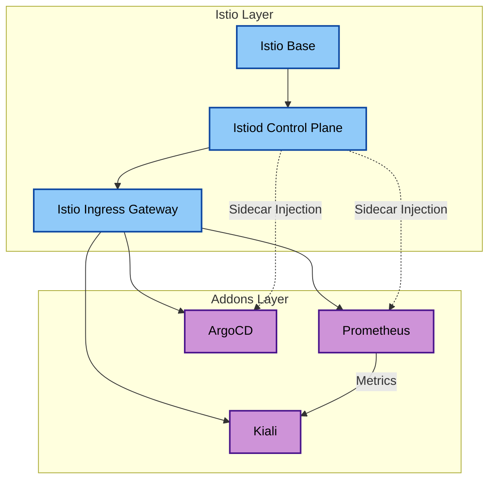

# orchestrator-custom-addons

Terraform module for installing custom addons on EKS clusters in the **urukube** platform. Provides opinionated, toggle-driven installation of the service mesh, observability, GitOps, and secrets management layers.

## Module Architecture

All addons are independently controlled via `enable_*` / `enable_argocd` variables. Istio is the networking foundation — when enabled, all other addons get sidecar injection and are exposed via the Istio Ingress Gateway using VirtualServices.

### Components

| Component | Toggle | Default | Helm Chart Version |
|---|---|---|---|
| Istio (base + istiod + gateway) | `enable_istio` | `false` | `1.30.1` |
| Kiali | `enable_kiali` | `false` | `2.26.0` |
| Prometheus | `enable_prometheus` | `false` | `29.13.0` |
| ArgoCD | `enable_argocd` | `false` | `9.6.0` |
| ArgoCD Image Updater | `enable_argocd` | `false` | `1.2.2` |
| External Secrets Operator | always on | — | `2.6.0` |

### Dependency Graph

### ArgoCD IAM Setup

When `enable_argocd = true`, two IAM roles are created:

**Hub role** (`argocd-hub-role.tf`) — IRSA role for the ArgoCD service accounts (`argocd-application-controller`, `argocd-repo-server`). Grants:
- `ecr:*` — pull Helm charts and images from ECR
- `eks:DescribeCluster` — build Kubernetes auth tokens for managed clusters

**Spoke role** (`argocd-spoke-role.tf`) — assumable by the hub ArgoCD role. Created on clusters that ArgoCD manages remotely. Requires `hub_cluster_name` to be set. Grants cluster-admin via EKS Access API.

### ESO ECR Pull

External Secrets Operator is always installed and wired to pull ECR credentials from the hub account. A `ClusterGenerator` fetches ECR auth tokens and a `ClusterExternalSecret` distributes the resulting pull secret to any namespace labeled `allow-hub-ecr-pull: "true"`.

Requires `hub_account_id` to be set.

<!-- BEGIN_TF_DOCS -->
## Requirements

| Name | Version |
|------|---------|
|  [terraform](#requirement\_terraform) | >= 1.5.0 |
|  [aws](#requirement\_aws) | >= 6.42.0 |
|  [helm](#requirement\_helm) | ~> 3.0 |
|  [kubectl](#requirement\_kubectl) | >= 1.14.0 |
|  [kubernetes](#requirement\_kubernetes) | >= 2.35.0 |

## Providers

| Name | Version |
|------|---------|
|  [aws](#provider\_aws) | >= 6.42.0 |
|  [helm](#provider\_helm) | ~> 3.0 |
|  [kubectl](#provider\_kubectl) | >= 1.14.0 |
|  [kubernetes](#provider\_kubernetes) | >= 2.35.0 |
|  [time](#provider\_time) | n/a |

## Modules

No modules.

## Inputs

| Name | Description | Type | Default | Required |
|------|-------------|------|---------|:--------:|
|  [app\_id](#input\_app\_id) | Application Unit | `string` | `null` | no |
|  [argocd\_version](#input\_argocd\_version) | Version of the ArgoCD Helm chart | `string` | `"9.6.0"` | no |
|  [bu\_id](#input\_bu\_id) | Business Unit | `string` | `null` | no |
|  [cluster\_certificate\_authority\_data](#input\_cluster\_certificate\_authority\_data) | Base64 encoded certificate authority data for the cluster | `string` | n/a | yes |
|  [cluster\_endpoint](#input\_cluster\_endpoint) | Endpoint URL of the EKS cluster API server | `string` | n/a | yes |
|  [cluster\_name](#input\_cluster\_name) | Name of the EKS cluster | `string` | n/a | yes |
|  [cluster\_oidc\_issuer\_url](#input\_cluster\_oidc\_issuer\_url) | URL of the OIDC issuer for the EKS cluster | `string` | n/a | yes |
|  [cluster\_oidc\_provider\_arn](#input\_cluster\_oidc\_provider\_arn) | ARN of the OIDC provider for IRSA | `string` | n/a | yes |
|  [domain\_url](#input\_domain\_url) | Base domain URL for the platform (e.g. platform.example.com) | `string` | `""` | no |
|  [enable\_argocd](#input\_enable\_argocd) | Enable ArgoCD addon | `bool` | `false` | no |
|  [enable\_istio](#input\_enable\_istio) | Enable Istio addon | `bool` | `false` | no |
|  [enable\_kiali](#input\_enable\_kiali) | Enable Kiali addon | `bool` | `false` | no |
|  [enable\_prometheus](#input\_enable\_prometheus) | Enable Prometheus addon | `bool` | `false` | no |
|  [env](#input\_env) | Environment name (dev, staging, prod) | `string` | n/a | yes |
|  [eso\_helm\_version](#input\_eso\_helm\_version) | Version of the External Secrets Operator Helm chart | `string` | `"2.6.0"` | no |
|  [hub\_account\_id](#input\_hub\_account\_id) | AWS account ID of the hub account for cross-account ECR access. Defaults to current account. | `string` | `""` | no |
|  [hub\_cluster\_name](#input\_hub\_cluster\_name) | Name of the hub EKS cluster. Required for the spoke role trust policy. | `string` | `""` | no |
|  [istio\_version](#input\_istio\_version) | Version of the Istio Helm chart | `string` | `"1.30.1"` | no |
|  [kiali\_version](#input\_kiali\_version) | Version of the Kiali Helm chart | `string` | `"2.26.0"` | no |
|  [prometheus\_version](#input\_prometheus\_version) | Version of the Prometheus Helm chart | `string` | `"29.13.0"` | no |
|  [tags](#input\_tags) | Tags to apply to all resources | `map(string)` | `{}` | no |

## Outputs

| Name | Description |
|------|-------------|
|  [argocd\_namespace](#output\_argocd\_namespace) | Namespace where ArgoCD is installed |
|  [argocd\_release\_name](#output\_argocd\_release\_name) | Name of the ArgoCD Helm release |
|  [argocd\_spoke\_role\_arn](#output\_argocd\_spoke\_role\_arn) | IAM role ARN assumable by hub ArgoCD |
|  [argocd\_spoke\_role\_name](#output\_argocd\_spoke\_role\_name) | IAM role name assumable by hub ArgoCD |
|  [istio\_base\_release\_name](#output\_istio\_base\_release\_name) | Name of the Istio Base Helm release |
|  [istio\_system\_namespace](#output\_istio\_system\_namespace) | Namespace where Istio is installed |
|  [istiod\_release\_name](#output\_istiod\_release\_name) | Name of the Istiod Helm release |
|  [kiali\_namespace](#output\_kiali\_namespace) | Namespace where Kiali is installed |
|  [kiali\_release\_name](#output\_kiali\_release\_name) | Name of the Kiali Helm release |
|  [prometheus\_namespace](#output\_prometheus\_namespace) | Namespace where Prometheus is installed |
|  [prometheus\_release\_name](#output\_prometheus\_release\_name) | Name of the Prometheus Helm release |
<!-- END_TF_DOCS -->
